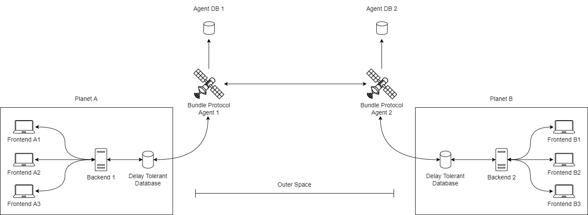

# Delay Tolerant Mongoose

[](https://www.npmjs.com/package/delay-tolerant-mongoose) [](https://www.npmjs.com/package/delay-tolerant-mongoose) [](https://www.npmjs.com/package/delay-tolerant-mongoose)

## **Table of contents**

- [About](#about)
- [Important Note](#important-note)
- [Motivation](#motivation)
- [How it works](#how-it-works)
- [How to use it](#how-to-use-it)
- [List of new methods](#list-of-new-methods)
- [DTN Configuration](#dtn-configuration)
- [Installation](#installation)
- [License](#license)

## **About**

**TL;DR:** This project is a wrapper for [Mongoose](https://mongoosejs.com/), that adds support for making your application delay tolerant.

## **Important Note**

This is still being in development, it's published for testing purposes.

## **Motivation**

Making your existing application delay tolerant (i.e. to work in a DTN) can be tedious, and will probably require a lot of extra work, learning new protocols (such as [µD3TN](https://gitlab.com/d3tn/ud3tn)), and rewriting of multiple modules.

So, in order to make that process easier, I created this new npm package, which connects and synchronizes multiple mongoose databases spread throughout a DTN.

What this package does is that it adds new mongoose methods (without deleting or modifying the existing ones) that are delay tolerant, and what they do is that when you update your local database, it also updates the non-local databases as well.

## **How it works**

It's quite simple really. The first thing you need to do, is having the configuration.

After configuring this module (you can read about how to do that [here](#dtn-configuration)), what it basically does is that:

1. First, it opens a TCP Socket Server in the configured host and port (`DTN_HOST` and `DTN_PORT`) to listen to μD3TN in order to get new incoming packages (i.e: non-local updates in the database).

2. When you update the database (i.e: you create/edit/delete documents), the new methods update the local database, but they also open a client connection to μD3TN and send the new changes to all the EIDs, that is, for all addresses where non-local databases are (configured in `EID_LIST`).

This two steps are almost all you need in order to update your non-local databases spread across a DTN. There are a few steps missing, like the serialization and deserialization of the bundles before sending them, but that's only details.

You can also copy this idea and create new wrappers for other common used Javascript databases, such as [mysql](https://github.com/mysqljs/mysql), [postgres](https://github.com/postgres/postgres), [SQL.js](https://github.com/sql-js/sql.js), or even [apache/nano](https://github.com/apache/nano). You could also copy this idea for other languages too.

This diagram tries to explain better how this project would work:



As you can see on the left, there is an ordinary application: users run the frontend (Frontend A1, A2, A3), while your server runs the backend (Backend 1), and the backend connects to the database. Nothing special.

What's interesting here, is that this database, in addition to being a normal database, it also connects to a Bundle Protocol Node (in this case, the Bundle Protocol Node 1) through the AAP Interface. That node is an instance of [µD3TN](https://gitlab.com/d3tn/ud3tn) running on a satellite.

The arrow that connects the DT-DB to the Bundle Protocol Agent 1 represents the exchange of data between those two. Is a round trip arrow, and not a one way arrow because you send your local updates from Backend 1 (let's say it is the local backend running here on Earth) but also you receive the non-local updates from the Backend 2 (let's say it is the backend running on Mars).

That exchange of data is made automatically by this module, so the only thing you have to worry about is to code your own application.

If you would like to know more about this project, you could read the [source code](https://github.com/octaviotastico/delay-tolerant-mongoose), or watch this YouTube playlist (coming soon I promise xD).

## **How to use it**

Let's say you have a backend (written in JavaScript) that uses mongoose.

Then, somewhere in your project, you call the connect method like this:

```javascript
const mongoose = import("mongoose");

mongoose.connect(DATABASE_URL).then(() => {
  console.log("Connected to database!");
});
```

And then, on the services of your endpoints, you'll have some functions like this:

```javascript
const YourModel = require("/models/your-model");

const getDocuments = async () => {
  return await YourModel.find({});
};

const saveDocument = async (document) => {
  return await YourModel.create(document);
};

const updateDocument = async (id, updatedDoc) => {
  return await YourModel.findByIdAndUpdate(id, updatedDoc, { new: false });
};

const deleteDocument = async (id) => {
  return await YourModel.findByIdAndRemove(id);
};
```

What these functions do is to connect your backend to your local database and save all your documents there.

To use this module, you just need to import `delay-tolerant-mongoose` instead of `mongoose`, and use it as follows:

```javascript
const mongoose = require("delay-tolerant-mongoose");

mongoose.connect(MONGO_URL).then(() => {
  console.log("Connected to database!");
});

mongoose.configDtnAndStart({
  AGENT_ID: 'your-agent-id',
  DTN_HOST: 'local-dtn-node-host',
  DTN_PORT: 'local-dtn-node-port',
  EID_LIST: [
    'non-local-dtn-node-address-1',
    'non-local-dtn-node-address-2',
    ...
  ],
});
```

This is almost all the changes you would need to do in order to synchronize all your databases.

As you can see, the only things that changed were the import and the new `configDtnAndStart` function call.

You have to call this method in order to configure your DTN variables. You can call it after or before the `mongoose.connect`.

What that function does is to configure μD3TN and starts a listener in `DTN_HOST`:`DTN_PORT` address, in order to update the local database in case any of the non-local backends adds new data to their databases.

To understand better the configuration object, you can go to the [DTN Configuration](#dtn-configuration) section.

After this, you are ready to start using the new delay tolerant methods in the services functions (here it is a list of [all the new methods](#list-of-new-methods)).

As stated earlier, the local methods are not deleted, so you can use the original [mongoose methods](https://mongoosejs.com/docs/api.html#Model), or the new delay tolerant methods of this package for **creating**, **updating** and **deleting** documents.

This is the previous example, but with the new methods.:

```javascript
const YourModel = require("/models/your-model");

const getDocuments = async () => {
  return await YourModel.find({});
};

const saveDocument = async (document) => {
  return await YourModel.dtCreate(document);
};

const updateDocument = async (id, updatedDoc) => {
  return await YourModel.dtFindByIdAndUpdate(id, updatedDoc, { new: false });
};

const deleteDocument = async (id) => {
  return await YourModel.dtFindByIdAndRemove(id);
};
```

As you probably noticed, only the methods that updates the database changed, not the ones that gets documents, like `find`.

And that is the last change you need to do, to update the names of the methods you call on the services.

## **List of new methods**

The list of the new delay tolerant methods is:

| Original Method     | Delay Tolerant Method | Description                                                                                    |
| ------------------- | --------------------- | ---------------------------------------------------------------------------------------------- |
| `create`            | `dtCreate`            | Saves a new document in the database                                                           |
| `insertMany`        | `dtInsertMany`        | Saves multiple documents in the database in one call (faster than multiple .create)            |
| `deleteOne`         | `dtDeleteOne`         | Deletes the first document that matches the given filter                                       |
| `deleteMany`        | `dtDeleteMany`        | Deletes many documents that matches the given filter                                           |
| `updateOne`         | `dtUpdateOne`         | Updates the first document that matches the given filter                                       |
| `updateMany`        | `dtUpdateMany`        | Updates many documents that matches the given filter                                           |
| `replaceOne`        | `dtReplaceOne`        | Replaces the first document matching the given filter                                          |
| `findOneAndDelete`  | `dtFindOneAndDelete`  | Finds a matching document, removes it, and returns the document                                |
| `findOneAndRemove`  | `dtFindOneAndRemove`  | Like findOneAndDelete, but becomes a MongoDB findAndModify() command, and returns the document |
| `findOneAndReplace` | `dtFindOneAndReplace` | Replaces the first document that matches the given filter, and returns the document            |
| `findOneAndUpdate`  | `dtFindOneAndUpdate`  | Updates the first document that matches the given filter, and returns the document             |
| `findByIdAndDelete` | `dtFindByIdAndDelete` | Triggers findOneAndDelete with the given ID, and returns the document                          |
| `findByIdAndRemove` | `dtFindByIdAndRemove` | Triggers findOneAndRemove with the given ID, and returns the document                          |
| `findByIdAndUpdate` | `dtFindByIdAndUpdate` | Triggers findOneAndUpdate with the given ID, and returns the document                          |

## **DTN Configuration**

- **AGENT_ID**: The Agent ID (the last part of the EID), to register your application.

  - **Example**: If the address of the μD3TN instance is `dtn://node-name.dtn/` and you decide to register your application as "myApp" (i.e. Agent ID = "myApp"), then your endpoint would be: `dtn://node-name.dtn/myApp`.

- **DTN_HOST**: This is the host of the μD3TN AAP interface. It is used to forward the messages in order to update the other instances of the database.

- **DTN_PORT**: This is the port of the μD3TN AAP interface. It is used to forward the messages in order to update the other instances of the database.

- **EID_LIST**: The list of nodes of the DTN (the Endpoint Identifiers) where your other databases are located. It's needed in order to update them when you create/edit/delete a document locally.

## **Installation**

If you use `npm`, just:

```
npm i delay-tolerant-mongoose
```

Or if you use `yarn`:

```
yarn add delay-tolerant-mongoose
```

Remember to remove the mongoose dependency from your `package.json`

You can do that by hand, or by doing:

```
npm uninstall mongoose
```

Or if you use `yarn`:

```
yarn remove mongoose
```

## **License**

The MIT license.
